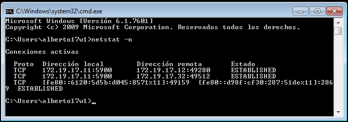

# A1: Acceso remoto VNC

## Propuesta de rúbrica

2.1 Comprobaciones finales Windows

- Conectamos Windows Master y GNU/linux Master al Windows Slave:

- Ir al servidor VNC y usar el comando netstat -n para ver las conexiones VNC con el cliente.

4.1 Comprobaciones finales GNU/Linux:

- Conectar Windows Master y GNU/Linux Master al GNu/Linux Slave.

- Ejecutamos lsoft -i -n en el servidorpara comprobar las conexiones VNC.

- Ejecutamos vncserver -list en el servidor.

