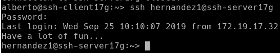

# A2: Acceso remoto con SSH

## 2.2 Primera conexión SSH desde cliente GNU/Linux

* Ir al cliente `sshclient17g`.
* `ping ssh-server17g`, comprobamos la conectividad con el servidor.

* `nmap -Pn ssh-serverXXg`, comprobamos los puertos abiertos en el servidor (SSH debe estar open).
Debe mostrarnos que el puerto 22 está abierto. Esto es, debe aparecer una línea como  "22/tcp open  ssh".

* Si esto falla debemos comprobar en el servidor la configuración del cortafuegos.

Vamos a comprobar el funcionamiento de la conexión SSH desde cada cliente usando el usuario *1er-apellido-alumno1*.
* Desde el cliente GNU/Linux nos conectamos mediante `ssh 1er-apellido-alumno1@ssh-serverXXg`. Capturar imagen del intercambio de claves que se produce en el primer proceso de conexión SSH.

* Si nos volvemos a conectar tendremos:

* Comprobamos contenido del fichero `$HOME/.ssh/known_hosts` en el equipo ssh-client17g.

* La clave que aparece es la clave de identificación de la máquina ssh-server.

* Una vez llegados a este punto deben de funcionar correctamente las conexiones SSH desde el cliente. Lo comprobamos.

## 3.2 Comprobamos

* Comprobamos qué sucede al volver a conectarnos desde los dos clientes, usando los  usuarios `1er-apellido-alumno2` y `1er-apellido-alumno1`. Sucede que al generar las nuevas claves públicas/privada para la identificación de nuestro servidor el cliente detecta que ha cambiado esa clave.

Nos sale un mensaje de warning ya que ha cambiado el identificador de host remoto.

* Para solucionarlo hacemos lo que no sale en el warning, lo que borrará esa clave almacenada en el cliente.

* Y volvemos a añadir la nueva clave.

## 5. Autenticación mediante claves públicas

  Vamos a la máquina ssh-client17g.

*  Iniciamos sesión con nuestro el usuario nombre-alumno de la máquina `ssh-client17g`.
  `ssh-keygen -t rsa` para generar un nuevo par de claves para el usuario en:

    *  `/home/nombre-alumno/.ssh/id_rsa`

    *  `/home/nombre-alumno/.ssh/id_rsa.pub`

* Ahora vamos a copiar la clave pública (`id_rsa.pub`), al fichero "authorized_keys" del usuario remoto 1er-apellido-alumno4 que está definido en el servidor.

  *  El modo recomendado es usando el comando `ssh-copy-id`. Ejemplo para copiar la clave pública del usuario actual al usuario remoto en la máquina remota: `ssh-copy-id 1er-apellido-alumno4@ssh-serverXXg`.

* Comprobamos que ahora al acceder remotamente vía SSH

  *  Desde `ssh-client17g`, NO se pide password.

  *  Desde `ssh-client17w`, SI se pide el password.

## 6. Uso de SSH como túnel para X

  *  Instalar en el servidor una aplicación de entorno gráfico (APP1) que no esté en los clientes. Por ejemplo Geany. Si estuviera en el cliente entonces buscar otra aplicación o desinstalarla en el cliente.

  *  Modificar servidor SSH para permitir la ejecución de aplicaciones gráficas, desde los clientes. Consultar fichero de configuración `/etc/ssh/sshd_config` (Opción X11Forwarding yes).

  

  *  Reiniciar el servicio SSH para que se lean los cambios de confiuración.

Vamos al cliente17g.

  *  `zypper` se APP1, comprobamos que no está instalado el programa APP1.

  *  Vamos a comprobar desde `ssh-client17g`, que funciona APP1(del servidor).

    *   `ssh -X primer-apellido-alumno1@ssh-serverXXg`, nos conectamos de forma remota al servidor, y ahora ejecutamos APP1 de forma remota.

## 8.1 Restricción sobre un usuario

Vamos a crear una restricción de uso del SSH para un usuario:

  *  En el servidor tenemos el usuario `primer-apellido2`. Desde local en el servidor podemos usar sin problemas el usuario.

  *  Vamos a modificar SSH de modo que al usar el usuario por SSH desde los clientes tendremos permiso denegado.

  *  Consultamos/modificamos fichero de configuración del servidor SSH (`/etc/ssh/sshd_config`) para restringir el acceso a determinados usuarios.

  *  Comprobamos la restricción al acceder desde los clientes.

