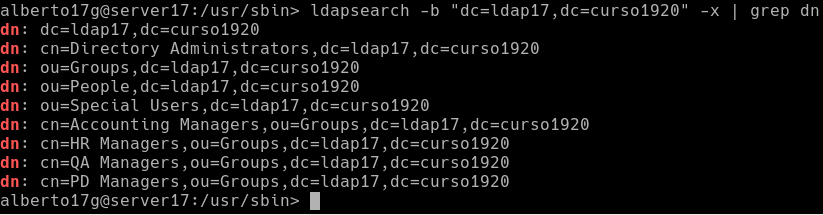
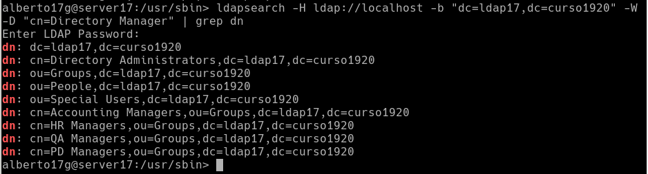
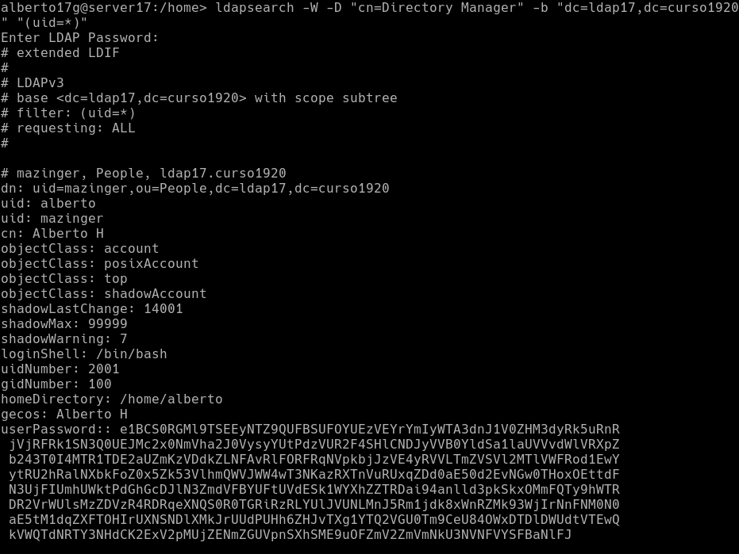
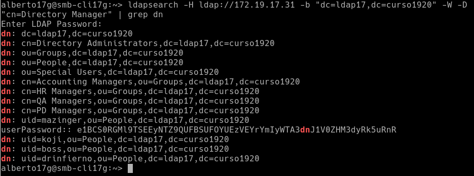

# Servidor 389-DS - OpenSUSE

## 2.3 Comprobamos el acceso al contenido del LDAP

* ldapsearch -b "dc=ldap17,dc=curso1920" -x | grep dn, muestra el contenido de nuestra base de datos LDAP.

* Comprobamos que existen las OU Groups y People.

* ldapsearch -H ldap://localhost -b "dc=ldap17,dc=curso1920" -W -D "cn=Directory Manager" | grep dn, en este caso hacemos la consulta usando usuario/clave.

## 3.3 Comprobar el nuevo usuario

* ldapsearch -W -D "cn=Directory Manager" -b "dc=ldap17,dc=curso1920" "(uid= * )", para comprobar si se ha creado el usuario en el LDAP.

## 4.3 Comprobar los usuarios creados

* Ir a la MV cliente LDAP.

* Ejecutar comando ldpasearch ... para consultar los usuarios LDAP en el servidor de directorios remoto.

