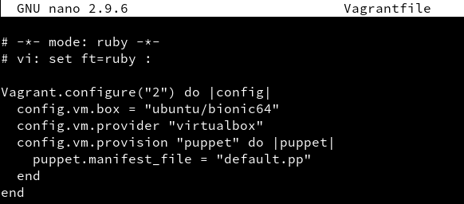

# Vagrant con VirtualBox

## 3.3 MV: Levantar y entrar

Vamos a crear una MV nueva y la vamos a iniciar usando Vagrant:

  * Debemos estar dentro de vagrant17-proyecto1.

  * vagrant up, para iniciar una nueva instancia de la máquina.

    

  * vagrant ssh: Conectar/entrar en nuestra máquina virtual usando SSH.

  

## 5.2 Comprobamos proyecto 2

Para confirmar que hay un servicio a la escucha en 4567, desde la máquina real podemos ejecutar los siguientes comandos:

* En el HOST-CON-VAGRANT (Máquina real). Comprobaremos que el puerto 4567 está a la escucha.

  * vagrant port para ver la redirección de puertos de la máquina Vagrant.

    

* En HOST-CON-VAGRANT, abrimos el navegador web con el URL http://127.0.0.1:4567. En realidad estamos accediendo al puerto 80 de nuestro sistema virtualizado.

  


## 6.1 Proyecto 3 (Suministro mediante shell script)

Ahora vamos a suministrar a la MV un pequeño script para instalar Apache.
* Crear directorio `vagrant17-proyecto3` y dentro un proyecto Vagrant.

  

* Crear fichero html/index.html con el siguiente contenido:

  

* Crear el script `install_apache.sh`, dentro del proyecto con el siguiente
contenido:

```
#!/usr/bin/env bash

apt-get update
apt-get install -y apache2

```

  

  


Incluir en el fichero de configuración Vagrantfile lo siguiente:

  * config.vm.provision :shell, :path => "install_apache.sh", para indicar a Vagrant que debe ejecutar el script install_apache.sh dentro del entorno virtual.

  * config.vm.synced_folder "html", "/var/www/html", para sincronizar la carpeta exterior html con la carpeta interior. De esta forma el fichero "index.html" será visible dentro de la MV.

  

  * vagrant up, para crear la MV.

    

      * Podremos notar, al iniciar la máquina, que en los mensajes de salida se muestran mensajes que indican cómo se va instalando el paquete de Apache que indicamos.


  * Para verificar que efectivamente el servidor Apache ha sido instalado e iniciado, abrimos navegador en la máquina real con URL http://127.0.0.1:4567.

  


## 6.2 Proyecto 4 (Suministro mediante Puppet)

Se pide hacer lo siguiente.

  * Crear directorio vagrant17-proyecto4 como nuevo proyecto Vagrant.

  * Modificar el archivo Vagrantfile de la siguiente forma:
```
Vagrant.configure(2) do |config|
  ...
  config.vm.provision "shell", inline: "sudo apt-get update && sudo apt-get install -y puppet"

  config.vm.provision "puppet" do |puppet|
    puppet.manifest_file = "alberto17.pp"
  end
 end
```
  

  

* Ahora hay que crear el fichero manifests/alberto17.pp, con las órdenes/instrucciones Puppet para instalar el programa PACKAGENAME. Ejemplo:

```
package { 'PACKAGENAME':
  ensure => 'present',
}
```

  

Para que se apliquen los cambios de configuración:

Con la MV encendida

  * vagrant reload, recargar la configuración.

  

  * vagrant provision, volver a ejecutar la provisión.

  

## 7.2 Crear caja Vagrant

Una vez hemos preparado la máquina virtual ya podemos crear el box.

  * Vamos a crear una nueva carpeta vagrant17-bulls, para este nuevo proyecto vagrant.

    

  * VBoxManage list vms, comando de VirtualBox que muestra los nombres de nuestras MVs. Elegiar una de las máquinas (VMNAME).

    

  * Nos aseguramos que la MV de VirtualBox VMNAME está apagada.

  * vagrant package --base VMNAME package.box, parar crear nuestra propia caja.

    

  * Comprobamos que se ha creado el fichero package.box en el directorio donde hemos ejecutado el comando.

    

  * vagrant box add alberto17/bulls package.box, añadimos la nueva caja creada por nosotros, al repositorio local de cajas vagrant de nuestra máquina.

    

  * vagrant box list, consultar ahora la lista de cajas Vagrant disponibles.

    
