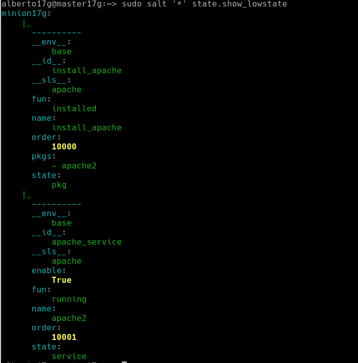

# 3. Master: instalar y configurar.

* Vamos a la MV1

* `zypper install salt-master`, instalar el software del master.


* Modificar `/etc/salt/master` para configurar nuestro master con:
```
interface: 172.19.17.31
file_roots:
  base:
    - /srv/salt
```


* `systemctl enable salt-master.service`, activiar servicio en el arranque del sistema.


* `systemctl start salt-master.service`, iniciar servicio.


* `salt-key -L`, para consultar Minions aceptados por nuestro Máster. Vemos que no hay ninguno todavía.
```
Accepted Keys:
Denied Keys:
Unaccepted Keys:
Rejected Keys:
```

---
# 4. Minion

Los Minios son los equipos que van a estar bajo el control del Máster.

## 4.1 Instalación y configuración

* `zypper install salt-minion`, instalar el software del agente (minion).


* Modificar `/etc/salt/minion` para definir quien será nuestro Máster:
```
master: 172.19.17.31
```


* `systemctl enable salt-minion.service`, activar Minion en el arranque del sistema.


* `systemctl start salt-minion.service`, iniciar el servico del Minion.


* Comprobar que  que no tenemos instalado `apache2` en el Minion.


## 4.2 Aceptación desde el Master

* Ir a la MV1 Máster.

* Hay que asegurarse de que el cortafuegos permite las conexiones al servicio Salt.


## 4.3 Aceptación desde el Master

Ir a MV1:
* `salt-key -L`, vemos que el Máster recibe petición del Minion.
```
Accepted Keys:
Denied Keys:
Unaccepted Keys:
minionXXg
Rejected Keys:
```


* `salt-key -a minionXXg`, para que el Máster acepte a dicho Minion.


* `salt-key -L`, comprobamos.


## 4.3 Comprobamos conectividad

Comprobamos la conectividad desde el Máster a los Minions.
```
# salt '*' test.version
minionXXg:
    2019.2.0
# salt '*' test.ping
minionXXg:
    True
```


> El símbolo `'*'` representa a todos los minions aceptados. Se puede especificar un minion o conjunto de minios concretos.

---
# 5. Salt States

## 5.1 Preparar el directorio para los estados

Vamos a crear directorios para guardar lo estados de Salt. Los estados de Salt son definiciones de cómo queremos que estén nuestras máquinas.

Ir al Máster:
* Crear directorios `/srv/salt/base` y `/srv/salt/dev`.


* Crear archivo `/etc/salt/master.d/roots.conf` con el siguiente contenido:
```
file_roots:
  base:
    - /srv/salt/base
  devel:
    - /srv/salt/devel
```


* Reiniciar el servicio del Máster.


Hemos creado dos directorios:
* base = para guardar nuestros estados.
* devel = para desarrollo o para hacer pruebas.

## 5.2 Crear un nuevo estado

Los estados de Salt se definen en ficheros SLS.
* Crear fichero `/srv/salt/base/apache/init.sls`:

```
install_apache:
  pkg.installed:
    - pkgs:
      - apache2

apache_service:
  service.running:
    - name: apache2
    - enable: True
```


Entendamos las definiciones:
* La primera línea es un identificador (ID) del estado.
* `pkg.installed`: se asegura que el paquete esté instalado.
* `service.running`: se asegura de que el servicio esté iniciado.
* `require`: Establece como requisito de que el servicio se inicia después de la instalación del paquete "apache2".

## 5.3 Asociar Minions a estados

Ir al Master:
* Crear `/srv/salt/base/top.sls`, donde asociamos a todos los Minions con el estado que acabamos de definir.

```
base:       
  '*':
    - apache
```


* `salt '*' state.show_states`, consultar los estados que tenemos:
```
minionXXg:
    - apache
```


## 5.4 Aplicar el nuevo estado

Ir al Master:
* Consultar los estados en detalle y verificar que no hay errores en las definiciones.
    * `salt '*' state.show_lowstate`



    * `salt '*' state.show_highstate`,


* `salt '*' state.apply apache`, para aplicar el nuevo estado en todos los minions. OJO: Esta acción puede tardar un tiempo.

```
minionXXg:
----------
          ID: install_apache
    Function: pkg.installed
      Result: True
     Comment: The following packages were installed/updated: apache2
              ...
----------
          ID: apache_service
    Function: service.running
        Name: apache2
      Result: True
     Comment: Service apache2 has been enabled, and is running
              ...

Summary for minionXXg
------------
Succeeded: 2 (changed=2)
Failed:    0
------------
Total states run:     2
Total run time: 105.971 s
```

> NOTA: Con este comando `salt '*' state.highstate`, también se pueden invocar todos los estados.

---
# 6. Crear estado "users"

Crear un estado llamado "users" que nos sirva para crear un usuario llamado "saltXX" en las máquinas Minions.

---
# 7. Añadir minion

* Crear MV3 con SO Windows (minionXXw)
* Instalar salt-minion y agregar al master.
