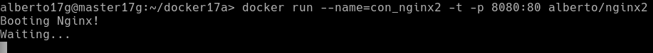

# 1. Contenedores con Docker


## 1.1 Instalación


Ejecutar como superusuario:

* `zypper in docker`, instalar docker.


* `systemctl start docker`, iniciar el servicio. NOTA: El comando `docker daemon` hace el mismo efecto.


* Incluir a nuestro usuario (nombre-del-alumno) como miembro del grupo `docker`.

Iniciar sesión como usuario normal.

* `docker version`, comprobamos que se muestra la información de las versiones cliente y servidor.


* Salir de la sesión y volver a entrar con nuestro usuario.

## 1.1 Habilitar el acceso a la red externa a los contenedores

Si queremos que nuestro contenedor tenga acceso a la red exterior, debemos activar tener activada la opción IP_FORWARD (`net.ipv4.ip_forward`). ¿Recuerdas lo que implica `forwarding` en los dispositivos de red?

* `cat /etc/sysctl.conf`, para consultar el estado de IP_FORWARD (desactivado=0, activo=1).


* Para activarlo podemos poner el valor 1 en el fichero de texto indicado o usar Yast.
* Reiniciar el equipo para que se aplique el cambio de configuración.


## 1.3 Primera prueba

* `docker images`, muestra las imágenes descargadas hasta ahora, y no debe haber ninguna.


* `docker ps -a`, muestra todos los contenedores creados y no debe haber ninguno por ahora.


* `docker run hello-world`:
    * Descarga una imagen "hello-world"
    * Crea un contenedor y
    * ejecuta la aplicación que hay dentro.


* `docker images`, ahora vemos la nueva imagen "hello-world" descargada.


* `docker ps -a`, vemos que hay un contenedor en estado 'Exited'.


* `docker stop IDContainer`, parar el conteneder.

* `docker rm IDContainer`, eliminar el contenedor.


# 2. Creación manual de nuestra imagen

Nuestro SO base es OpenSUSE, pero vamos a crear un contenedor Debian,
y dentro instalaremos Nginx.

## 2.1 Crear un contenedor manualmente

**Descargar una imagen**
* `docker search debian`, buscamos en los repositorios de Docker Hub contenedores con la etiqueta `debian`.


* `docker pull debian`, descargamos una imagen en local.


* `docker images`, comprobamos.


**Crear un contenedor**: Vamos a crear un contenedor con nombre `con_debian` a partir de la imagen `debian`, y ejecutaremos el programa `/bin/bash` dentro del contendor:
* `docker run --name=app1debian -i -t debian /bin/bash`


## 2.2 Personalizar el contenedor

Ahora dentro del contenedor, vamos a personalizarlo a nuestro gusto:

**Instalar aplicaciones dentro del contenedor**

```
root@IDContenedor:/# cat /etc/motd            # Comprobamos que estamos en Debian
root@IDContenedor:/# apt-get update
root@IDContenedor:/# apt-get install -y nginx # Instalamos nginx en el contenedor
root@IDContenedor:/# apt-get install -y nano   # Instalamos editor vi en el contenedor
```


**Crear un fichero HTML** `holamundo.html`.

```
root@IDContenedor:/# echo "<p>Hola Alberto</p>" > /var/www/html/holamundo.html
```


**Crear un script** `/root/server.sh` con el siguiente contenido:

```
#!/bin/bash
echo "Booting Nginx!"
/usr/sbin/nginx &

echo "Waiting..."
while(true) do
  sleep 60
done
```


Recordatorio:
* Hay que poner permisos de ejecución al script para que se pueda ejecutar.
* La primera línea de un script, siempre debe comenzar por `#!/`, sin espacios.
* Este script inicia el programa/servicio y entra en un bucle, para permanecer activo y que no se cierre el contenedor.

## 2.3 Crear una imagen a partir del contenedor

Ya tenemos nuestro contenedor auto-suficiente de Nginx, ahora debemos vamos a crear una nueva imagen que incluya los cambios que hemos hecho.

* Abrir otra ventana de terminal.
* `docker commit con_debian alberto/nginx`, a partir del CONTAINERID vamos a crear la nueva imagen que se llamará "alberto/nginx".


* `docker images`, comprobamos.


# 3. Crear contenedor a partir de nuestra imagen

## 3.1 Crear contenedor con Nginx

Ya tenemos una imagen "alberto/nginx" con Nginx instalado.
* `docker run --name=con_nginx -p 80 -t alberto/nginx /root/server.sh`, iniciar el contenedor a partir de la imagen anterior.


> El argumento `-p 80` le indica a Docker que debe mapear el puerto especificado del contenedor, en nuestro caso el puerto 80 es el puerto por defecto sobre el cual se levanta Nginx.

## 3.2 Comprobamos

* Abrimos una nueva terminal.
* `docker ps`, nos muestra los contenedores en ejecución. Podemos apreciar que la última columna nos indica que el puerto 80 del contenedor está redireccionado a un puerto local `0.0.0.0.:PORT -> 80/tcp`.


* Abrir navegador web y poner URL `0.0.0.0.:PORT`. De esta forma nos
conectaremos con el servidor Nginx que se está ejecutando dentro del contenedor.


* Comprobar el acceso a `holamundo.html`.


* Paramos el contenedor `con_nginx` y lo eliminamos.


Como ya tenemos una imagen docker con Nginx, podremos crear nuevos contenedores cuando lo necesitemos.

## 3.3 Migrar la imágen a otra máquina


**Exportar** imagen Docker a fichero tar:
* `docker save -o ~/alumno17.tar alberto/nginx`, guardamos la imagen
"nombre-alumno/server" en un fichero tar.


Intercambiar nuestra imagen exportada con la de un compañero de clase.

**Importar** imagen Docker desde fichero:
* Coger la imagen de un compañero de clase.
* Nos llevamos el tar a otra máquina con docker instalado, y restauramos.

* `docker load -i ~/alumnoXX.tar`, cargamos la imagen docker a partir del fichero tar.


* `docker images`, comprobamos que la nueva imagen está disponible.


# 4. Dockerfile

Ahora vamos a conseguir el mismo resultado del apartado anterior, pero
usando un fichero de configuración. Esto es, vamos a crear un contenedor a partir de un fichero `Dockerfile`.

## 4.1 Preparar ficheros

* Crear directorio `/home/alberto/docker17a`.
* Entrar el directorio anterior.


* Poner copia del fichero `holamundo.html` anterior.


* Poner copia del fichero `server.sh` anterior.


* Crear el fichero `Dockerfile` con el siguiente contenido:

```
FROM debian

MAINTAINER nombre-del-alumnoXX 1.0

RUN apt-get update
RUN apt-get install -y apt-utils
RUN apt-get install -y nginx

COPY holamundo.html /var/www/html
RUN chmod 666 /var/www/html/holamundo.html

COPY server.sh /root/server.sh
RUN chmod 755 /root/server.sh

EXPOSE 80

CMD ["/root/server.sh"]
```


## 4.2 Crear imagen a partir del `Dockerfile`

El fichero Dockerfile contiene toda la información necesaria para construir el contenedor, veamos:

* `cd docker17a`, entramos al directorio con el Dockerfile.

* `docker build -t nombre-alumno/nginx2 .`, construye una nueva imagen a partir del Dockerfile. OJO: el punto final es necesario.


* `docker images`, ahora debe aparecer nuestra nueva imagen.


## 4.3 Crear contenedor y comprobar

A continuación vamos a crear un contenedor con el nombre `con_nginx2`, a partir de la imagen `alberto/con_nginx2`. Probaremos con:

```
docker run --name=app4nginx2 -p 8080:80 -t nombre-alumno/nginx2
```



Desde otra terminal:
* `docker ps`, para averiguar el puerto de escucha del servidor Nginx.


* Comprobar en el navegador:
    * URL `http://localhost:PORTNUMBER`


    * URL `http://localhost:PORTNUMBER/holamundo.html`


Ahora que sabemos usar los ficheros Dockerfile, nos damos cuenta que es más sencillo usar estos ficheros para intercambiar con nuestros compañeros que las herramientas de exportar/importar que usamos anteriormente.

## 4.4 Usar imágenes ya creadas

El ejemplo anterior donde creábamos una imagen Docker con Nginx se puede simplificar aún más aprovechando imágenes oficiales que ya existen.


* Crea el directorio `docker17b`. Entrar al directorio.


* Crea el siguiente `Dockerfile`

```
FROM nginx

COPY holamundo.html /var/www/html
RUN chmod 666 /var/www/html/holamundo.html
```


* `docker build -t alberto/nginx3`, crear la imagen.


* `docker run --name=app5nginx3 -d -p 8080:80 nombre-alumno/nginx3`, crear contenedor.


---
# 5. Limpiar contenedores e imágenes

Cuando terminamos con los contenedores, y ya no lo necesitamos, es buena idea pararlos y/o destruirlos.
* `docker ps -a`


* `docker stop ...`


* `docker rm ...`


Lo mismo con las imágenes:
* `docker images`


* `docker rmi ...`


